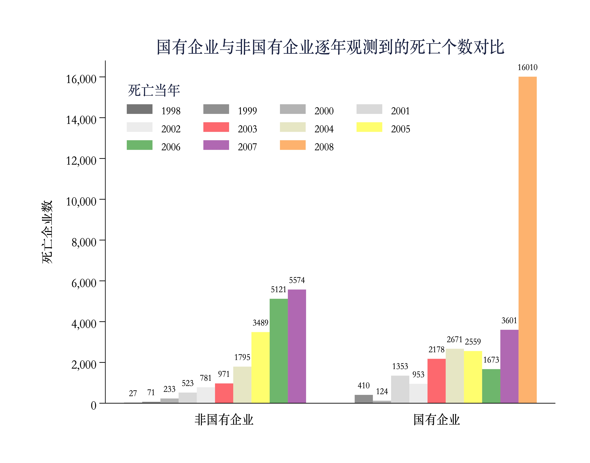
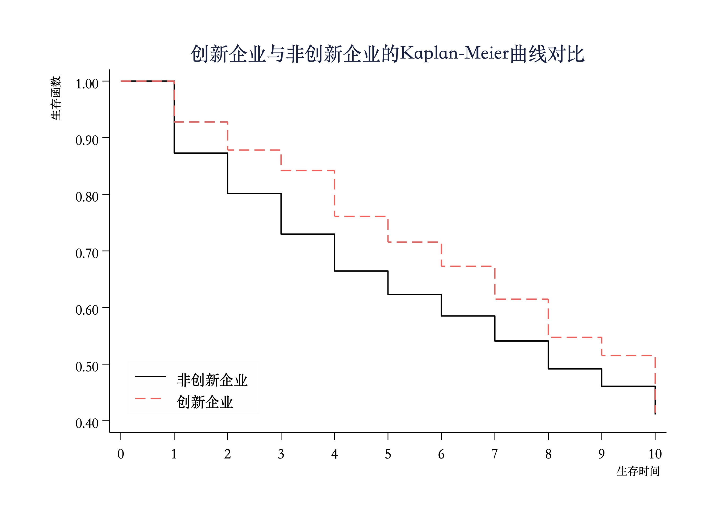
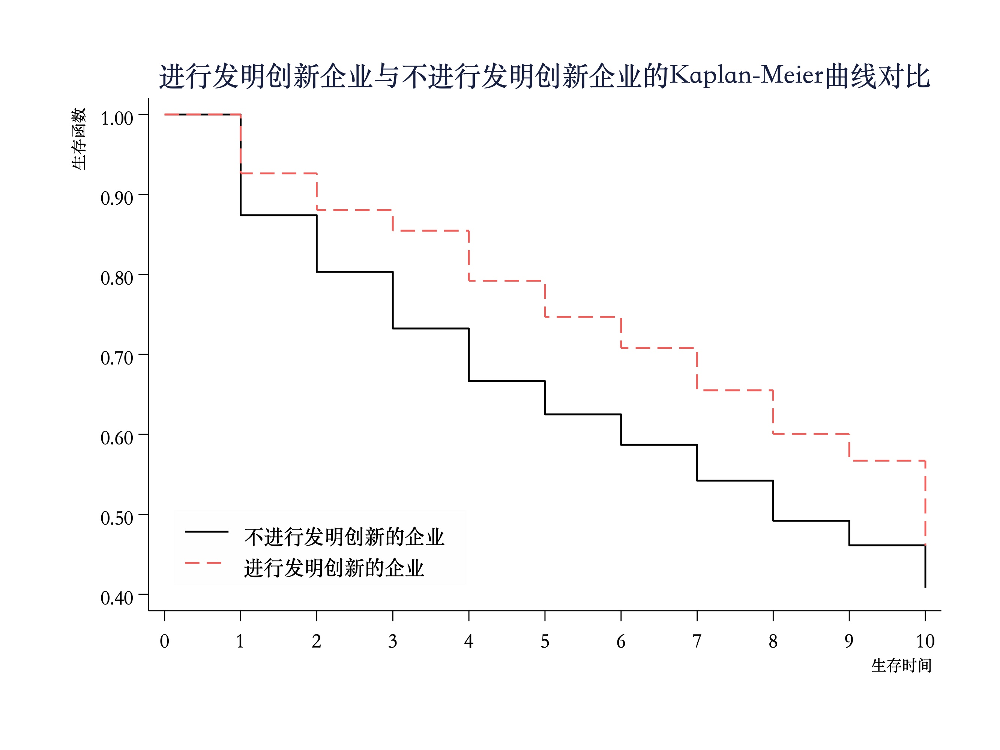
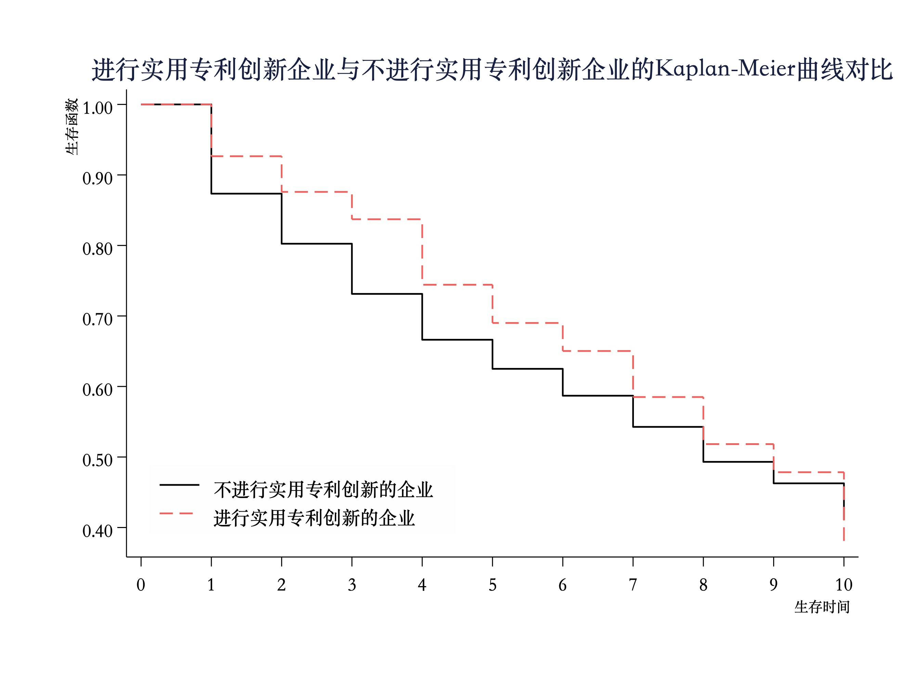
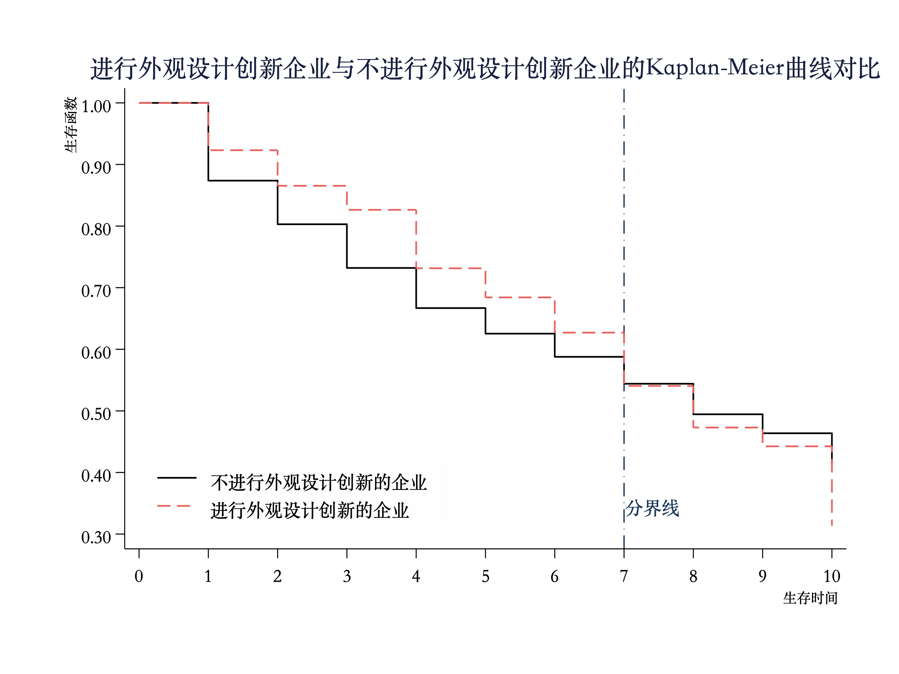

```{r setup, include=FALSE}
knitr::opts_chunk$set(echo = TRUE,
                      dpi = 400,
                      warning = FALSE,
                      message = FALSE,
                      fig.align = 'center',
                      comment = "#>")
```


# 1、本文摘要

  本文基于1998-2007年的中国工业企业数据库以及对应年份的中国专利数据库，按照组织机构代码进行匹配，构造一个既包含企业基本财务、生存情况，又包含企业创新行为的微观面板数据，并借用生存分析中，可捕捉未观测个体异质性的离散时间风险模型——互补重对数            $Clog-clog$ 模型，从三种不同类型的创新行为分析了创新与企业生存率间的关系。

--

.content-box-army[本文的发现如下]：

--


- 根据KM生存曲线的估计结果：
  1. 较之于完全没有创新行为的企业，任意一种创新行为均可显著降低企业的死亡率；
  2. 三类不同的创新行为对企业生存率的影响随时间的变化趋势不尽相同；

--

- 根据基准回归和近一步分析的回归结果：
  1. 首先是验证了KM曲线所反映的规律；
  2. 其次发现了创新行为和企业生存率之间的存在非线性关系。

--

- 虽然基准回归和拓展性分析存在一定的内生性问题，但是根据内生性检验的结果发现，内生性程度在可接受范围之内，本文的结论研究可算是稳健的。

这是最新的说法。


---

# 2、数据说明


```{r echo=FALSE}
# 时序图
highchart() %>% # 使用JavaScript方式
  hc_chart(
    type = "timeline", # 指定何种geoms
    style = list(
      fontFamily = cnfont
    )
  ) %>%
  hc_xAxis(visible = F) %>% 
  hc_yAxis(visible = F) %>%
  hc_colors(
    colors = list('#4185F3',
		'#427CDD',
		'#406AB2',
		'#3E5A8E',
		'#3B4A68')
  ) %>% 
  hc_series(
    list(
      data = list(
        list(
          name = '第一步：数据整理',
    			description = '工企数据中缺失值和不合理值的处理，以全部从业人员年平均人数人为例。'),
        list(
          name = '第二步：数据匹配',
    			description = '以组织机构代码作为键位进行匹配。'
        ),
        list(
          name ='第三步：企业生存状况',
    			description ='无论国企还是非国企，将企业第一次出现在数据库中的时间定义为企业新生当年。'
        ),
        list(
          name = '第四步：企业死亡状况',
    			description = '对于国企，定义其出现在数据库中的最后一年为死亡当年；<br>对于非国企，只有其最后一年的营业状态非“正常营业”或“筹建”才被定义为当年死亡。'
        ),
        list(
          name ='第五步：KM曲线对比',
    			description ='以国企与非国企、创新企业与非创新企业以及三类创新行为有无作为分类依据，进行KM曲线的对比。')
      )
    )
  ) 
```


---

# 2.1、数据整理

以工企中的 `全部从业人员年平均人数人` 为例。首先处理不合理的极大值，若该企业只存在一期，则删去该行观测值；若存在多期，则替换为缺失值，随后处理。当数据存在<span style='color:navy'>缺失</span>、<span style='color:navy'>负数</span>或<span style='color:navy'>为零</span>情况时，均需要进行填补。

处理顺序：缺失值 &rArr; 负数 &rArr; 零值；处理原则：先补再删。


--

①   缺失值的处理

使用线性插值法对缺失值进行填补，填补之后依然缺失的删去。并且，此时会产生缺失值变成 0 或负数的情况。

②   负数的处理

由于线性插值的特点，很容易导致个体在期初或期末的值被填为负数。因此，期初、期末的负值，使用最近一期的非负值进行填补。

③   零值的处理

将 0 转为缺失值，重复以上两步。即迭代使用`ipolate`，直到这三类值的总数前后两次相等。

--

.foot[[注：在本文的处理中，最后删去的样本量为18201，较之于简单删去79230个缺失值，样本损失要小得多。]]


---

# 2.2、数据匹配


```{r echo=FALSE}
library("haven")
pk <- read_dta("data/pk.dta")
highchart() %>% # 使用JavaScript方式
  hc_chart(
    spacingBottom = 40,
    spacingTop = 60,
    spacingLeft = 40,
    spacingRight = 60,
    style = list(fontFamily = cnfont)
  ) %>%
  hc_xAxis(
    categories = unique(pk$year)
  ) %>% 
  hc_yAxis_multiples(
    list(
      title = list(text = "单类专利数量"),opposite = F
    ),
    list(
      title = list(text = "三类专利总数"),opposite = T
    )
  ) %>% 
  hc_add_series(
    type = "column",
    data = pk$a1,
    name = "本文所用数据",
    yAxis = 1
  ) %>% 
  hc_add_series(
    type = "column",
    data = pk$a2,
    name = "寇宗来所用数据(《经济研究》2020-3 )",
    yAxis = 1
  ) %>% 
  hc_add_series(
    type = "line",
    data = pk$d,
    name = "外观设计专利",
    yAxis = 0
  ) %>% 
  hc_add_series(
    type = "line",
    data = pk$i,
    name = "发明专利",
    yAxis = 0
  ) %>% 
  hc_add_series(
    type = "line",
    data = pk$u,
    name = "实用新型专利",
    yAxis = 0
  ) %>% 
  hc_legend(
    floating = T,
    verticalAlign = "top",align = "left",
    x = 70, y =50
  ) %>% 
  hc_tooltip(
    shared = T,crosshairs = T
  ) %>% 
  hc_title(
    text = "工业企业数据库与中国专利数据库匹配结果展示",
    y = -10,
    style = list(
      fontSize = "20px"
    )
  ) %>% 
  hc_caption(
    text = "数据来源：98~07年工业企业数据库 & 中国专利数据库"
  )
```


---

# 2.3、企业生存现状 


```{r echo=FALSE}
df <- tibble(
  记录当年 = c(1998,1999,2000,2001,2002,2003,2004,2005,2006,2007),
  "1998" = c(5392,3100,3013,1897,1617,1252,840,814,737,689),
  "1999" = c(0,5938,4521,2965,2556,2106,1552,1457,1334,1269),
  "2000" = c(0,0,12866,777, 6834,582, 4307,404, 3756,3515),
  "2001" = c(0,0,0,25838,21398,17683, 12411,11793,11035,10330 ),
  "2002" = c(0,0,0,0,22440, 12858,12705, 12013,11240, 10604),
  "2003" = c(0,0,0,0,0,21755,20677,21223,19880,18536),
  "2004" = c(0,0,0,0,0,0,105720, 80292, 74914, 70481),
  "2005" = c(0,0,0,0,0,0,0,35010 ,30333 ,27843),
  "2006" = c(0,0,0,0,0,0,0,0,47783 ,43580),
  "2007" = c(0,0,0,0,0,0,0,0,0,55751)
)


df %>%
  map_df(sum) %>% pivot_longer(-记录当年,names_to = "新生当年",values_to = "数量") %>% select(-1) -> column


df %>% pivot_longer(-记录当年,names_to = "新生当年",values_to = "数量")%>% 
  relocate(新生当年) %>%  
  arrange(新生当年) %>% 
  group_by(新生当年,记录当年) %>% ungroup() %>% group_nest(新生当年) %>% 
  mutate(
    id = 新生当年,
    type = "column",
    data = map(data,mutate,name = 记录当年, y = 数量),
    data = map(data,list_parse)
  ) -> drilldown

column %>% 
  hchart("column",
    hcaes(新生当年,数量,
    name = 新生当年,drilldown = 新生当年),
    name = "企业数量",colorByPoint = T,
    style = list(fontFamily = cnfont)
    ) %>% 
  hc_drilldown(
    allowPointDrilldown = T,
    series = list_parse(
      drilldown
    ),
    colorByPoint = T,
    drillUpButton = list(
      relativeTo = 'spacingBox',
      postition = list(x = 1,y = 0)
    )
  ) %>% 
  hc_plotOptions(
    column = list(
      datLabels = list(
        enabled = T
      )
    )
  ) %>% 
  hc_title(
    text = "1998~2007年中国新生企业生存状况",
    style= list(fontFamily = cnfont)
  ) %>% 
  hc_subtitle(
    text = "按照新生当年进行区分",
    style = list(fontFamily = cnfont)
  ) %>% 
  hc_yAxis(
    title = list(
      text = "企业数量",
      style = list(fontFamily = cnfont)
    )
  ) %>% 
  hc_xAxis(
    title = list(
      text = "" ,
      style = list(fontFamily = cnfont)
    )
  ) %>% 
  hc_caption(
    text = "数据来源：作者整理",
    style = list(fontFamily = cnfont)
  ) 
```


---


# 2.4、企业死亡状况

```{r, echo=FALSE, fig.align='center', out.width='65%'}

```


- 对于非国企来说，虽然其定义死亡的条件要弱于国企，但其死亡数量逐年稳定上升。

- 对于国企而言，虽其死亡企业数在00年、02年和06年均有不同程度的下降，但整体上还是属于一个逐年递增的趋势。尤其在07年之后，死亡企业数量出现激增。


---

# 2.5、KM曲线对比

.pull-left[

```{r, echo=FALSE, fig.align='center', out.width='100%',fig.show='hold'}



```
```{r, echo=FALSE, fig.align='center', out.width='100%',fig.show='hold'}



```
]


.pull-right[
```{r, echo=FALSE,fig.align='center', out.width='100%',fig.show='hold'}


```
```{r, echo=FALSE,fig.align='center', out.width='100%',fig.show='hold'}


```
]
---
# 3、实证分析


```{r echo=FALSE}
# 时序图
highchart() %>% # 使用JavaScript方式
  hc_chart(
    type = "timeline", # 指定何种geoms
    style = list(
      fontFamily = cnfont
    )
  ) %>%
  hc_xAxis(visible = F) %>% 
  hc_yAxis(visible = F) %>%
  hc_colors(
    colors = list('#4185F3',
		'#427CDD',
		'#406AB2',
		'#3E5A8E',
		'#3B4A68')
  ) %>% 
  hc_series(
    list(
      data = list(
        list(
          name = '3.1、模型设定',
    			description = '较之于 Cox 模型，Clog-log 模型的优势；<br>Clog-log 模型的理论推导。'),
        list(
          name = '3.2、变量说明',
    			description = '在控制行业和时间固定效应的情况下，从三个角度来选取模型中的解释变量。'
        ),
        list(
          name ='3.3、基准回归结果分析',
    			description ='较之于无创新企业，创新企业的生存率更高；<br>在三类不同的创新行为中，外观设计的创新行为对企业生存率的影响在统计上并不显著。'
        ),
        list(
          name ='3.4、近一步分析',
    			description ='发明创新行为对企业生存率的影响近似于线性关系，而其他两种则表现为非线性关系。'
        ),
        list(
          name ='3.5、内生性检验',
    			description ='分别选取滞后一期的企业创新数据与所在行业除去该企业创新行为平均数作为工具变量进行内生性检验。<br>结果发现无论是哪一种工具变量，系数的显著性和符号和基准回归结果均相当近似。<br>因此，认为本文模型的内生性程度在可接受范围内，估计结果具有稳健性。'
        )
      )
    )
  ) 
```

---


# 3.1、模型设定

通过一系列的推导，    $Clog-log$  模型的最终估计形式可以写成：

\begin{equation}
\begin{array}{r}
Cloglog[Pr(death_{it}=1)]=\beta_{0}+ \alpha*Innovation + \beta_{1}*Firmlevel_{it}+\beta_{2}*Sectorlevel_{it}+ \\
YEAR+REGION+\gamma_{t}+\varepsilon_{it}
\end{array}
\end{equation}


$\beta_0$、    $\beta_1$ 、    $\beta_2$ 分别表示；    $Firmlevel$ 和    $Sectorlevel$ 分别表示企业层面和行业层面的一些控制变量；    $YEAR$  和    $REGION$  分别表示年份和地区固定效应；    $\gamma_t$  表示时变的基准风险率；   $\varepsilon_{it}$ 表示误差项，该项捕捉了未观测的个体异质性。其中，    $\alpha$  为重点关注系数。


---
# 3.2、变量说明

```{r echo=FALSE}
library(DT)
tibble(
  类别 = c(rep("<span style='font-size:15px'>创新行为</span>",4),rep("<span style='font-size:15px'>企业层面</span>",5),rep("<span style='font-size:15px'>行业层面</span>",3)),
  名称 = c(
    "<span style='font-size:15px'>inn</span>",
    "<span style='font-size:15px'>i</span>",
    "<span style='font-size:15px'>u</span>",
    "<span style='font-size:15px'>d</span>",
    "<span style='font-size:15px'>control</span>",
    "<span style='font-size:15px'>constraint</span>",
    "<span style='font-size:15px'>profit</span>",
    "<span style='font-size:15px'>size</span>",
    "<span style='font-size:15px'>age</span>",
    "<span style='font-size:15px'>competition_ratio</span>",
    "<span style='font-size:15px'>inn_ratio</span>",
    "<span style='font-size:15px'>capital_ratio</span>"
    ),
  说明 = c(
    "<span style='font-size:15px'>0-1变量，衡量企业有无创新</span>",
    "<span style='font-size:15px'>连续变量，衡量企业有无发明的创新</span>",
    "<span style='font-size:15px'>连续变量，衡量企业有无实用新型的创新</span>",
    "<span style='font-size:15px'>连续变量，衡量企业有无实用外观设计的创新</span>",
    
    "<span style='font-size:15px'>依据企业控股情况分为三类：国有控股企业、港澳台外资控股企业、其他控股企业</span>",
    "<span style='font-size:15px'>使用流动资产减去流动负债的差值与总资产的比值来衡量</span>",
    "<span style='font-size:15px'>使用税前利润总额与资产总额的比值来衡量</span>",
    "<span style='font-size:15px'>使用全部从业人员年平均人数的对数值进行衡量，同时引入平方项</span>",
    "<span style='font-size:15px'>从企业加入数据库当年减去企业成立年来衡量，同时引入平方项</span>",
    
    "<span style='font-size:15px'>使用该年该行业新注册的公司数量与该年初已有公司总数量的比值衡量</span>",
    "<span style='font-size:15px'>任意一种创新行为不为0的企业数除以该行业新生企业总数的比来衡量</span>",
    "<span style='font-size:15px'>使用该行业所有企业人均资本比值的均值来衡量</span>"
    )
) %>% 
  DT::datatable(width = "90%", height = "20px",
                rownames = FALSE, # 去除表头
                filter = "top", # 在顶部添加过滤控件
                options = list(
                  autoWidth = TRUE,
                  pageLength = 4, # 每页显示的数量
                  # order = list(0, "asc"), # 书名列的排序方式
                  initComplete = htmlwidgets::JS(
                    "function(settings, json) {",
                    "$(this.api().table().container()).css({'font-family': 'SourceHanSerifSC-Medium'});",
                    "}")
                )
  )

```


---

# 3.3、基准回归结果分析

```{r echo=FALSE}
tribble(
 ~" ", ~ "(1)", ~"(2)",~"(3)",~"(4)",
  "<span style='font-size:15px'>inn dummy</span>",
  "<span style='font-size:15px'>-0.329***</span>",
  "<span style='font-size:15px'> </span>",
  "<span style='font-size:15px'> </span>",
  "<span style='font-size:15px'> </span>",
  "<span style='font-size:15px'>logi</span>",
  "<span style='font-size:15px'> </span>",
  "<span style='font-size:15px'>-0.226***</span>",
  "<span style='font-size:15px'> </span>",
  "<span style='font-size:15px'> </span>",
  "<span style='font-size:15px'>logd</span>",
  "<span style='font-size:15px'> </span>",
  "<span style='font-size:15px'> </span>",
  "<span style='font-size:15px'>-0.018</span>",
  "<span style='font-size:15px'> </span>",
  "<span style='font-size:15px'>logu</span>",
  "<span style='font-size:15px'> </span>",
  "<span style='font-size:15px'> </span>",
  "<span style='font-size:15px'> </span>",
  "<span style='font-size:15px'>-0.118***</span>",
  "<span style='font-size:15px'>constraint</span>",
  "<span style='font-size:15px'>-0.006*</span>",
  "<span style='font-size:15px'>-0.006*</span>",
  "<span style='font-size:15px'>-0.006*</span>",
  "<span style='font-size:15px'>-0.006*</span>",
  "<span style='font-size:15px'>profit</span>",
  "<span style='font-size:15px'>-0.035***</span>",
  "<span style='font-size:15px'>-0.035***</span>",
  "<span style='font-size:15px'>-0.035***</span>",
  "<span style='font-size:15px'>-0.035***</span>",
  "<span style='font-size:15px'>size</span>",
  "<span style='font-size:15px'>-0.655***</span>",
  "<span style='font-size:15px'>-0.645***</span>",
  "<span style='font-size:15px'>-0.642***</span>",
  "<span style='font-size:15px'>-0.652***</span>",
  "<span style='font-size:15px'>size2</span>",
  "<span style='font-size:15px'>0.044***</span>",
  "<span style='font-size:15px'>0.043***</span>",
  "<span style='font-size:15px'>0.042***</span>",
  "<span style='font-size:15px'>0.044***</span>",
  "<span style='font-size:15px'>age</span>",
  "<span style='font-size:15px'>-0.079***</span>",
  "<span style='font-size:15px'>-0.080***</span>",
  "<span style='font-size:15px'>-0.080***</span>",
  "<span style='font-size:15px'>-0.080***</span>",
  "<span style='font-size:15px'>age2</span>",
  "<span style='font-size:15px'>0.016***</span>",
  "<span style='font-size:15px'>0.016***</span>",
  "<span style='font-size:15px'>0.016***</span>",
  "<span style='font-size:15px'>0.016***</span>",
  "<span style='font-size:15px'>competition</span>",
  "<span style='font-size:15px'>1.229</span>",
  "<span style='font-size:15px'>-0.217</span>",
  "<span style='font-size:15px'>8.847**</span>",
  "<span style='font-size:15px'>-10.947</span>",
  "<span style='font-size:15px'>inn_ratio</span>",
  "<span style='font-size:15px'>0.257***</span>",
  "<span style='font-size:15px'>0.209***</span>",
  "<span style='font-size:15px'>0.309***</span>",
  "<span style='font-size:15px'>0.010</span>",
  "<span style='font-size:15px'>capital</span>",
  "<span style='font-size:15px'>0.520***</span>",
  "<span style='font-size:15px'>0.453***</span>",
  "<span style='font-size:15px'>0.458***</span>",
  "<span style='font-size:15px'>0.231***</span>",
  "<span style='font-size:15px'>常数项</span>",
  "<span style='font-size:15px'>-2.949***</span>",
  "<span style='font-size:15px'>-2.994***</span>",
  "<span style='font-size:15px'>-3.002***</span>",
  "<span style='font-size:15px'>-2.972***</span>"
) %>% 
  DT::datatable(width = "90%", height = "20px",
                rownames = FALSE, # 去除表头
                filter = "top", # 在顶部添加过滤控件
                options = list(
                  autoWidth = TRUE,
                  pageLength = 7, # 每页显示的数量
                  # order = list(0, "asc"), # 书名列的排序方式
                  initComplete = htmlwidgets::JS(
                    "function(settings, json) {",
                    "$(this.api().table().container()).css({'font-family': 'SourceHanSerifSC-Medium'});",
                    "}")
                )
  ) 

```


---

class:center

# 感谢您的聆听！


```{r, echo=FALSE, fig.align='center', out.width='65%'}
knitr::include_graphics("pic/logo.jpg")
```


<br>
<span style='color:steelblue'>汇报人：张沐</span>

